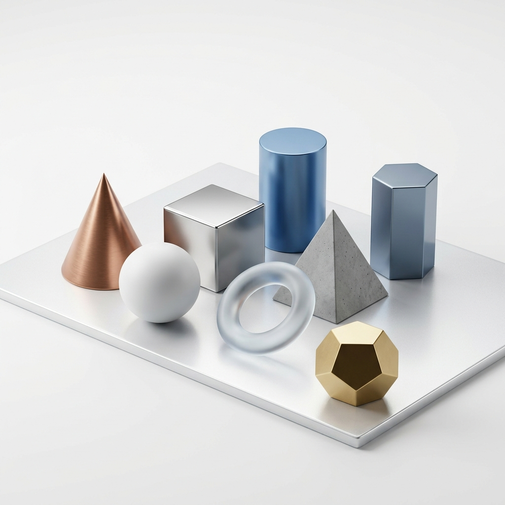

# GEO 3D 🧊 — Interactive Geometry Encyclopedia

GEO 3D is a premium, portfolio-level web application designed to bring mathematics and geometry to life. Featuring a state-of-the-art interactive 3D viewer, real-time physics, and a comprehensive educational encyclopedia, this project aims to make exploring geometry engaging, intuitive, and visually stunning.



## ✨ Features

*   **Interactive 3D Shape Viewer:** Render and explore over 15 distinct geometric primitives and complex topological shapes (from simple cones to complex torus knots and icosahedrons).
*   **Real-time Physics Engine:** Built-in `CANNON.js` physics integration. Toggle gravity and watch 3D shapes physically interact and bounce with realistic restitution and friction.
*   **Multiple Rendering Materials:** Switch between solid rendering, wireframe, neon emission, and flat-shaded educational views on the fly.
*   **Comprehensive "Learn" Encyclopedia:** A massive 13-module interactive course covering everything from basic angles and 2D polygons to advanced 3D mensuration and Euler's polyhedron formula.
*   **Mathematical Foundations:** Explore interactive formulas, coordinate systems, matrices, and quaternions.
*   **Premium Glassmorphic UI:** Modern frosted-glass aesthetics, fluid scroll animations, dynamic glow cursors, and full responsive support for mobile devices.

## 🛠️ Technology Stack

*   **Core:** HTML5, CSS3 (Vanilla), JavaScript (ES6+)
*   **3D Rendering:** `Three.js` (r128)
*   **Physics:** `CANNON.js` (0.6.2)
*   **Post-processing:** `Three.js EffectComposer` (UnrealBloomPass for neon emission effects)
*   **Styling:** Zero CSS frameworks. Custom CSS variables, Grid/Flexbox layouts, and keyframe animations.

## 📂 Project Structure

*   `index.html` - The main entry point featuring the 3D Viewer and Shape Library.
*   `learn.html` - The Interactive Geometry Encyclopedia.
*   `math.html` - The Mathematical Foundations module.
*   `css/styles.css` - Global design system and glassmorphic UI components.
*   `css/learn.css` - Layout specifics for the encyclopedia.
*   `js/script.js` - Global interactions, Three.js initialization, physics loop, and post-processing.
*   `js/learn.js` - Logic for the interactive encyclopedia calculators and dynamic canvas simulations.

## 🚀 How to Run Locally

Because the project loads external textures and JavaScript modules via WebGL, it **must** be run through a local HTTP server (opening `index.html` directly in the browser via `file://` will result in CORS errors).

### Option 1: Using Node.js (Recommended)
If you have Node.js and `npm` installed, you can use `http-server` or `serve`.

1. Open a terminal in the project root directory.
2. Run the following command:
   ```bash
   npx http-server -p 8080 -c-1
   ```
   *(The `-c-1` flag disables caching so your changes appear immediately).*
3. Open your browser and navigate to `http://localhost:8080`.

### Option 2: Using Python
If you have Python installed, you can use its built-in HTTP server.

1. Open a terminal in the project root directory.
2. For **Python 3.x**:
   ```bash
   python -m http.server 8080
   ```
3. Open your browser and navigate to `http://localhost:8080`.

### Option 3: Using VS Code
If you use Visual Studio Code as your editor:
1. Install the **Live Server** extension by Ritwick Dey.
2. Right-click `index.html` and select **"Open with Live Server"**.

## 🤝 Contributing
Contributions are always welcome! Whether it's adding new shapes, refining physics properties, or expanding the educational encyclopedia. Feel free to open an issue or submit a pull request.

## 📝 License
&copy; 2026 Geometry in Three Dimensions. All rights reserved.
